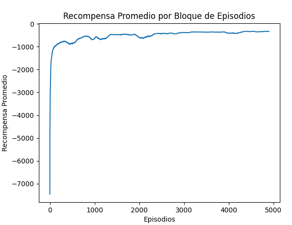

# Q-Learning en `MountainCar-v0` con Gymnasium

Este proyecto implementa un agente Q-Learning para resolver el entorno clásico `MountainCar-v0` de OpenAI Gymnasium, analizando el impacto de **diferentes tasas de aprendizaje (`alpha`)** y **niveles de discretización (`num_bins`)**.

---

## Código Principal

```python
import gymnasium as gym
import numpy as np
import random
import matplotlib.pyplot as plt
from matplotlib import animation  
from tqdm import tqdm

# Crear entorno con modo compatible para capturar frames
env = gym.make("MountainCar-v0", render_mode="rgb_array")  

# Definir número de bins como variable
num_bins = 40

# Función para discretizar estados usando la variable
def discretizar(estado, bins=num_bins):
    escala = (estado - env.observation_space.low) / (env.observation_space.high - env.observation_space.low)
    return tuple(np.clip((escala * bins).astype(np.int32), 0, bins - 1))

# Inicializar la Q-Table con la variable
q_table = np.random.uniform(low=-1, high=1, size=[num_bins, num_bins, env.action_space.n])

# Hiperparámetros
alpha = 0.02  # Tasa de aprendizaje
gamma = 0.95  # Factor de descuento
epsilon = 1.0  # Probabilidad de exploración inicial
epsilon_min = 0.01  # Valor mínimo de epsilon
epsilon_decay = 0.995  # Factor de reducción de epsilon por episodio
episodios = 5000  # Número total de episodios

# Almacena las recompensas por episodio
recompensas_totales = []

# Bucle de entrenamiento
for episodio in tqdm(range(episodios)):
    estado, _ = env.reset()
    estado = discretizar(estado)
    done = False
    recompensa_total = 0

    while not done:
        # Política ε-greedy
        if random.uniform(0, 1) < epsilon:
            accion = env.action_space.sample()  # Exploración
        else:
            accion = np.argmax(q_table[estado])  # Explotación

        # Tomar acción en el entorno
        nuevo_estado, recompensa, done, _, _ = env.step(accion)
        nuevo_estado = discretizar(nuevo_estado)

        # Actualizar Q-Table usando la ecuación de Bellman
        if done:
            valor_futuro = 0
        else:
            valor_futuro = np.max(q_table[nuevo_estado])

        q_table[estado][accion] += alpha * (recompensa + gamma * valor_futuro - q_table[estado][accion])

        # Actualizar estado
        estado = nuevo_estado
        recompensa_total += recompensa

    # Reducir ε gradualmente hasta su valor mínimo
    epsilon = max(epsilon_min, epsilon * epsilon_decay)

    # Almacenar recompensa del episodio
    recompensas_totales.append(recompensa_total)

    # Mostrar información cada 100 episodios
    if episodio % 100 == 0:
        print(f"Episodio {episodio} - Recompensa Promedio: {np.mean(recompensas_totales[-100:]):.2f}, Epsilon: {epsilon:.3f}")

# Gráfica de recompensas
plt.plot(np.convolve(recompensas_totales, np.ones(100) / 100, mode='valid'))
plt.title("Recompensa Promedio por Bloque de Episodios")
plt.xlabel("Episodios")
plt.ylabel("Recompensa Promedio")
plt.show()

# Evaluación después del entrenamiento
episodios_prueba = 10
recompensas_prueba = []
frames = []  

for episodio in range(episodios_prueba):
    estado, _ = env.reset()
    estado = discretizar(estado)
    done = False
    recompensa_total = 0

    while not done:
        accion = np.argmax(q_table[estado])
        nuevo_estado, recompensa, done, _, _ = env.step(accion)
        nuevo_estado = discretizar(nuevo_estado)
        estado = nuevo_estado
        recompensa_total += recompensa

        if episodio == episodios_prueba - 1:  
            frame = env.render()
            frames.append(frame)

    recompensas_prueba.append(recompensa_total)
    print(f"Episodio de Prueba {episodio + 1}: Recompensa = {recompensa_total}")

print(f"\nRecompensa Promedio en Evaluación: {np.mean(recompensas_prueba):.2f}")

fig = plt.figure()
img = plt.imshow(frames[0])

def animate(i):
    img.set_data(frames[i])
    return [img]

ani = animation.FuncAnimation(fig, animate, frames=len(frames), interval=40, blit=True)
ani.save("mountaincar.gif", writer="pillow", fps=25)
plt.close()
```

## Conclusión sobre la variación de la tasa de aprendizaje (`alpha`) de 0.01 a 0.05

### 1. `alpha = 0.01`
- **Recompensa promedio:** -202.10  
- **Comportamiento:**  
  Recompensas consistentemente bajas (~ -200). El modelo aprende lentamente pero de forma estable. La mejora es mínima, indicando que la tasa es muy baja para un aprendizaje eficiente.

### 2. `alpha = 0.02`
- **Recompensa promedio:** -152.60  
- **Comportamiento:**  
  El rendimiento mejora significativamente. El modelo ajusta pesos de manera más efectiva, lo que resulta en mejores soluciones y un aprendizaje más rápido.

### 3. `alpha = 0.03`
- **Recompensa promedio:** -148.50  
- **Comportamiento:**  
  Aún mejor desempeño. Aunque la mejora respecto a 0.02 es leve, sigue siendo positiva. Parece estar cerca del punto óptimo de aprendizaje.

### 4. `alpha = 0.04`
- **Recompensa promedio:** -170.60  
- **Comportamiento:**  
  Disminuye el rendimiento. Aumenta la variabilidad, el modelo hace ajustes más agresivos y posiblemente salta óptimos locales.

### 5. `alpha = 0.05`
- **Recompensa promedio:** -169.00  
- **Comportamiento:**  
  Rendimiento similar a 0.04. Ligeramente mejor en promedio, pero sigue mostrando inestabilidad. No mejora sustancialmente el aprendizaje.

---

### Resumen

| Tasa de Aprendizaje | Recompensa Promedio | Estabilidad | Observaciones |
|---------------------|---------------------|-------------|---------------|
| 0.01                | -202.10             | Alta        | Muy lento     |
| 0.02                | -152.60             | Buena       | Mejor resultado |
| 0.03                | -148.50             | Buena       | Leve mejora adicional |
| 0.04                | -170.60             | Media       | Variabilidad y pérdida |
| 0.05                | -169.00             | Media-Baja  | Inestable     |

**Conclusión general:**  
Una tasa de aprendizaje **moderada (0.02 o 0.03)** ofrece el mejor equilibrio entre **estabilidad** y **velocidad de aprendizaje**. A tasas más altas, el aprendizaje se vuelve inestable. Se selecciona 0.02 ya que no tiene mucha diferencia con 0.03

---

## Comparativo de `num_bins`: 20, 30, 40 y 50

### `num_bins = 20`
- Mejora rápida al inicio (~ -94,535 → ~ -500 en 500 episodios)
- Estabilidad desde el episodio 3000 (~ -200)
- Picos bajos entre ~ -176 y -162

**Conclusión:**  
Buen rendimiento general, con aprendizaje rápido y variabilidad aceptable al final.

---

### `num_bins = 30`
- Mejora inicial más rápida y **estable**
- Alcanza ~ -155.5 a -153.3 hacia los episodios 4500-4700

**Conclusión:**  
**Mayor estabilidad** que con 20 bins y mejor desempeño promedio final.

---

### `num_bins = 40`
- Mejora estable y progresiva
- Desde episodio 3500, recompensas < -140
- Episodios finales: recompensas entre **-132** y **-124**

**Conclusión:**  
**Excelente rendimiento**. Captura mejor los estados sin comprometer la generalización.

---

### `num_bins = 50`
- Desde episodio 3000: recompensas entre **-135** y **-125**
- Episodio 4800 logra **-117**
- Más oscilaciones que con 40 bins

**Conclusión:**  
**Mejor resultado absoluto**, pero menos estable. Algo más ruidoso que con 40 bins.

---
### Demo



### Resumen Comparativo

| `num_bins` | Recompensa Final Aproximada | Estabilidad Final       | Velocidad de Convergencia |
|------------|-----------------------------|--------------------------|----------------------------|
| 20         | ~ -176 a -162               | Media                    | Rápida                     |
| 30         | ~ -155 a -153               | Buena                    | Rápida                     |
| 40         | ~ -132 a -124               | **Excelente**            | Rápida                     |
| 50         | ~ -130 a -117               | Buena, algo oscilante    | Rápida                     |

---

### Conclusión Final

- Mejor balance (rendimiento + estabilidad): `num_bins = 40`
- Mejor recompensa máxima lograda: `num_bins = 50` (pero menos estable)
- Mejor opción si se busca simplicidad: `num_bins = 30`

---


